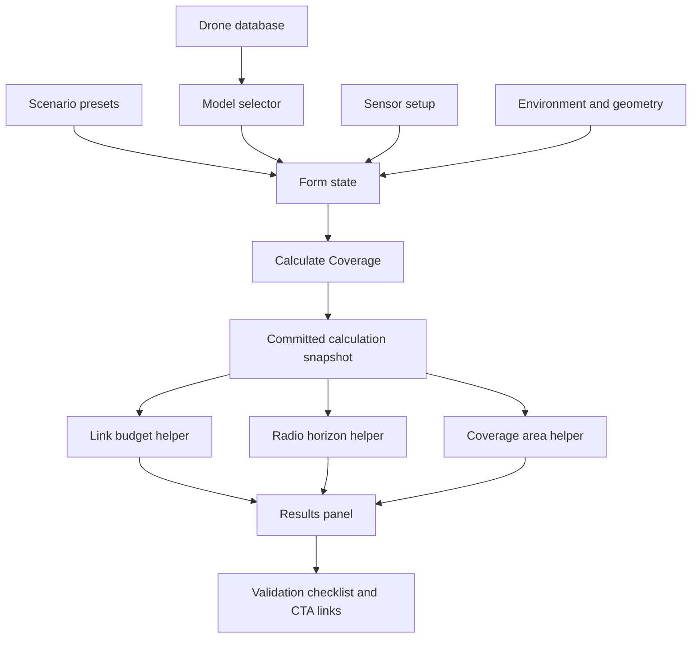

# RF Detection Coverage Planner 设计文档

## 1. 文档目的

本文档记录 CounterUAVHub 后续新增工具 **RF Detection Coverage Planner** 的产品定义、计算模型、页面结构、数据依赖、合规边界、测试要求和开发拆解。

后续正式开发时，以本文档作为需求基线。若实际实现需要调整，应先更新本文档，再进入编码。

## 2. 产品定位

**RF Detection Coverage Planner** 是一个面向反无人机侦测系统前期规划的工程估算工具。

它不只回答“RF 探测距离是多少”，而是帮助用户估算：

- 某个 RF 侦测传感器在指定频段下的理论探测半径。
- 环境损耗、系统损耗、天线高度和无线电视距对覆盖的影响。
- 单传感器和多传感器的粗略覆盖面积。
- 当前计算结果的限制因素和可信度。
- 现场部署前需要验证哪些工程条件。

英文页面建议名称：

```text
RF Detection Coverage Planner
```

英文副标题建议：

```text
Estimate passive RF drone detection coverage using public signal data, receiver sensitivity, antenna gain, terrain assumptions, and line-of-sight constraints.
```

## 3. 目标用户

| 用户类型 | 典型问题 | 工具价值 |
|---|---|---|
| 安防 / 低空安防从业者 | 一个 RF 侦测点大概能覆盖多远？ | 快速形成方案前期判断 |
| RF / 系统工程师 | 链路预算余量是否够？限制因素是什么？ | 辅助工程沟通和参数敏感性分析 |
| 机场 / 园区 / 关键基础设施安全人员 | 不同环境下覆盖会缩水多少？ | 用于非正式规划和采购前讨论 |
| 研究人员 / 内容读者 | RF 侦测距离为什么不是固定值？ | 提供可解释的公开教育内容 |

## 4. 合规和安全边界

本工具只用于 **被动 RF 侦测覆盖估算**，不输出主动压制、干扰、规避或实操攻击步骤。

页面和结果区必须包含以下边界表达：

- Results are first-order engineering estimates, not deployment guarantees.
- Passive RF detection depends on active emissions, antenna placement, local noise, terrain, and protocol behavior.
- Frequency references alone do not identify a drone.
- Always verify with official documentation, local regulations, site survey data, and controlled field testing.

中文内部原则：

- 只做公开资料、链路预算、侦测规划和验证清单。
- 不给具体“怎么压制 / 怎么绕过 / 怎么对抗”的操作细节。
- 对敏感场景使用 “authorized counter-UAS assessment / lawful RF monitoring / engineering planning” 表达。

## 5. 与现有工具的关系

当前已有工具：

| 现有工具 | 当前作用 | 与新工具关系 |
|---|---|---|
| `/tools/rf-detection-range` | 单点 RF 探测距离计算 | 可以保留为简化版，也可以后续重定向到新工具 |
| `/tools/fspl-calculator` | 自由空间路径损耗计算 | 新工具复用其 FSPL 基础模型 |
| `/tools/drone-frequency-database` | 无人机频段和信号数据 | 新工具从数据库预填频段、功率、链路带宽等字段 |
| `/drones/[slug]` | 型号详情页 | 增加 “Estimate RF detection coverage” 入口 |
| `/bands/[band]` | 频段聚合页 | 增加 “Plan detection coverage for this band” 入口 |
| `/brands/[brand]` | 品牌聚合页 | 引导用户选择具体型号后进入覆盖估算 |

推荐路线：

1. 新增独立页面 `/tools/rf-detection-coverage-planner`。
2. 保留 `/tools/rf-detection-range` 作为轻量旧工具，第一阶段不删除。
3. 新工具上线稳定后，再评估是否将旧工具重定向或改成简化入口。

## 6. MVP 范围

第一版只做静态前端计算，不做地图、不做数据库、不做服务端 API、不做真实地理覆盖仿真。

MVP 必须包含：

- 场景预设。
- 无人机型号或频段预设。
- RF 传感器参数输入。
- 环境损耗和系统损耗输入。
- 天线高度和无线电视距限制。
- 单传感器覆盖半径。
- 多传感器粗略覆盖面积。
- 链路预算余量。
- 限制因素解释。
- 结果可信度标签。
- 工程验证清单。
- GA4 事件埋点。
- SEO metadata 和 JSON-LD。
- 单元测试覆盖核心计算函数。

MVP 不做：

- 地图绘制。
- 地形剖面分析。
- Fresnel 区复杂建模。
- 多站真实几何叠加。
- 具体设备推荐和报价。
- 主动干扰操作建议。

## 7. 页面结构

建议页面从上到下分为 6 个区块。

### 7.1 Header

内容：

- H1: `RF Detection Coverage Planner`
- 说明：用于被动 RF 侦测覆盖的首阶工程估算。
- 免责声明：结果不是部署保证。

建议英文：

```text
Estimate passive RF drone detection coverage from public signal data, receiver sensitivity, antenna gain, site environment, and line-of-sight constraints.
```

### 7.2 Scenario Presets

预设用于快速填入环境损耗、传感器高度、目标高度和验证提示。

| Preset | 适用场景 | 环境损耗建议 | 传感器高度 | 目标高度 |
|---|---|---:|---:|---:|
| Open field | 开阔场地、测试场 | 3 dB | 6 m | 100 m |
| Airport perimeter | 机场周界 | 6 dB | 10 m | 120 m |
| Suburban infrastructure | 园区、郊区设施 | 10 dB | 8 m | 80 m |
| Urban critical infrastructure | 城市关键设施 | 18 dB | 15 m | 80 m |
| Industrial site | 油库、电站、工厂 | 15 dB | 12 m | 80 m |

说明：

- 这些不是标准值，只是保守估算起点。
- 页面应允许用户手动覆盖。

### 7.3 Signal Source

输入项：

| 字段 | 类型 | 默认来源 | 说明 |
|---|---|---|---|
| Drone model | select | `drones.json` | 可选，选择后预填频段和功率 |
| Emission type | select | 手动 | `Control link reference` / `Video downlink reference` / `Custom emitter` |
| Frequency | number / preset | `controlFreqMHz[0]` | MHz |
| Reference EIRP | number | `gcsTxPowerDbm` 或手动 | dBm |
| Signal bandwidth | number | `controlChannelBW_MHz` | MHz，用于提示，不直接决定探测距离 |
| Source confidence | badge | `source-confidence` helper | 显示数据可信度 |

重要建模说明：

现有数据中的 `gcsTxPowerDbm` 更接近控制链路发射端参考值，不应在 UI 中简单称为 “drone power”。页面统一使用 **Reference EIRP** 或 **Signal emitter EIRP**，避免把控制端、机载端、视频端混为一谈。

如果后续数据库补充 `droneDownlinkEirpDbm` 或 `videoTxPowerDbm`，新工具可以扩展为按 emission type 使用不同字段。

### 7.4 RF Sensor Setup

输入项：

| 字段 | 默认值 | 单位 | 说明 |
|---|---:|---|---|
| Receiver sensitivity | -95 | dBm | 传感器最小可检测信号 |
| Receiver antenna gain | 6 | dBi | 接收天线增益 |
| Cable / system loss | 2 | dB | 馈线、连接器、系统损耗 |
| Required detection margin | 6 | dB | 工程余量，避免刚好贴边 |
| Sensor height | 10 | m | 影响无线电视距 |
| Number of sensors | 1 | count | 用于粗略覆盖面积估算 |
| Overlap factor | 0.75 | ratio | 多站覆盖折减，避免简单叠加过乐观 |

### 7.5 Environment and Geometry

输入项：

| 字段 | 默认值 | 单位 | 说明 |
|---|---:|---|---|
| Environment loss | 6 | dB | 场景预设填入，可手动修改 |
| Drone / emitter height | 100 | m | 影响无线电视距 |
| Local noise note | text | optional | 只做提示，不进入 MVP 计算 |

后续版本可以扩展 local noise floor，但 MVP 暂不加入，以免输入过重。

### 7.6 Results

输出项：

| 输出 | 说明 |
|---|---|
| Link-budget detection range | 只按链路预算反推的最大距离 |
| Radio-horizon limit | 按天线高度和目标高度估算的无线电视距 |
| Effective detection radius | `min(linkBudgetRange, horizonRange)` 后再做保守折减 |
| Link budget margin at target radius | 用户设定目标半径时，显示余量 |
| Coverage area per sensor | `π × radius²` |
| Estimated multi-sensor area | `single area × sensor count × overlap factor` |
| Limiting factor | `Sensitivity-limited` / `Horizon-limited` / `Environment-limited` |
| Confidence | High / Medium / Low |
| Verification checklist | 现场验证清单 |

## 8. 计算模型

### 8.1 单位转换

```text
EIRP_W = 10 ^ ((EIRP_dBm - 30) / 10)
Sensitivity_W = 10 ^ ((Sensitivity_dBm - 30) / 10)
```

### 8.2 FSPL

使用距离为 km、频率为 MHz 的形式：

```text
FSPL_dB = 32.44 + 20 × log10(distance_km) + 20 × log10(frequency_MHz)
```

### 8.3 接收功率

```text
Pr_dBm =
  EIRP_dBm
  + Rx_Antenna_Gain_dBi
  - FSPL_dB
  - Cable_System_Loss_dB
  - Environment_Loss_dB
```

### 8.4 探测门限

```text
Required_Pr_dBm = Receiver_Sensitivity_dBm + Required_Detection_Margin_dB
```

### 8.5 探测余量

```text
Detection_Margin_dB = Pr_dBm - Required_Pr_dBm
```

### 8.6 按链路预算反推距离

当 `Detection_Margin_dB = 0` 时：

```text
Max_FSPL_dB =
  EIRP_dBm
  + Rx_Antenna_Gain_dBi
  - Cable_System_Loss_dB
  - Environment_Loss_dB
  - Required_Pr_dBm
```

```text
Range_km =
  10 ^ ((Max_FSPL_dB - 32.44 - 20 × log10(frequency_MHz)) / 20)
```

### 8.7 无线电视距

```text
Radio_Horizon_km = 3.57 × (sqrt(sensor_height_m) + sqrt(emitter_height_m))
```

### 8.8 有效覆盖半径

```text
Effective_Radius_km =
  min(Link_Budget_Range_km, Radio_Horizon_km)
```

MVP 不再额外乘环境系数，因为环境损耗已经以 dB 形式进入链路预算。若要做展示上的保守系数，应命名为 `planning confidence factor`，不要和环境损耗重复计算。

### 8.9 覆盖面积

```text
Single_Sensor_Area_km2 = π × Effective_Radius_km²
```

```text
Multi_Sensor_Area_km2 =
  Single_Sensor_Area_km2 × Sensor_Count × Overlap_Factor
```

Overlap factor 建议范围：

| 取值 | 含义 |
|---:|---|
| 0.55 | 高冗余或复杂遮挡 |
| 0.70 | 常规工程保守估算 |
| 0.85 | 低重叠、开阔部署 |

## 9. 结果解释规则

### 9.1 Limiting factor

| 条件 | 输出 |
|---|---|
| `Radio_Horizon_km < Link_Budget_Range_km × 0.9` | Horizon-limited |
| `Environment_Loss_dB >= 18` | Environment-limited |
| `Max_FSPL_dB` 只略高于当前目标距离需求 | Sensitivity-limited |
| 以上都不明显 | Balanced estimate |

### 9.2 Confidence

| 条件 | Confidence |
|---|---|
| 官方或 FCC 来源、margin >= 10 dB、环境损耗 <= 10 dB | High |
| 第三方来源或 margin 3-10 dB | Medium |
| profile fallback、margin < 3 dB、城市复杂环境 | Low |

### 9.3 Result copy

结果区建议给出三类解释：

1. **What the number means**
   当前半径是基于公开 EIRP、接收灵敏度、天线增益和场景损耗的首阶估算。

2. **What may reduce it**
   地形、遮挡、多径、本地噪声、天线极化、协议跳频和天线方向都可能降低实际效果。

3. **What to verify**
   需要用现场扫频、实测链路、设备规格和法规边界验证。

## 10. UI 交互原则

沿用本项目已验证的计算器模式：

- live form state 和 committed calculation state 分离。
- 用户点击 `Calculate Coverage` 后才更新主要结果。
- 预设点击可以立即提交并刷新结果。
- 输入不合法时保留上一次有效结果，同时提示当前输入需要修正。
- 不因每次键盘输入导致结果闪烁。

建议按钮：

```text
Calculate Coverage
Recalculate
Reset Scenario
Use selected drone model
```

## 11. 数据流



## 12. 推荐文件结构

正式开发时建议新增：

```text
web/app/tools/rf-detection-coverage-planner/page.tsx
web/lib/rf-coverage.mjs
web/scripts/rf-coverage.test.mjs
```

建议修改：

```text
web/app/tools/page.tsx
web/app/sitemap.ts
web/components/Footer.tsx
web/app/tools/drone-frequency-database/page.tsx
web/app/drones/[slug]/page.tsx
web/app/bands/[band]/page.tsx
04-研发任务拆解.md
PROJECT_STATUS.md
```

如果后续决定替换旧工具，再修改：

```text
web/app/tools/rf-detection-range/page.tsx
```

## 13. SEO 设计

页面 title：

```text
RF Detection Coverage Planner
```

Meta description：

```text
Estimate passive RF drone detection coverage using receiver sensitivity, antenna gain, frequency, environment loss, and line-of-sight constraints.
```

关键词方向：

| Keyword | 意图 |
|---|---|
| drone RF detection range calculator | 工程计算 |
| counter-UAS detection coverage planner | 方案规划 |
| RF sensor range calculator | 传感器能力估算 |
| drone detection coverage planning | 安防场景 |
| passive RF drone detection | 技术解释 |

JSON-LD：

- `@type`: `WebApplication`
- `applicationCategory`: `UtilitiesApplication`
- `operatingSystem`: `Web`
- `offers.price`: `0`

## 14. 站内链接策略

| 来源页面 | 链接文案 |
|---|---|
| Tools index | RF Detection Coverage Planner |
| Drone detail page | Estimate RF detection coverage for this model |
| Drone database expanded row | Plan detection coverage |
| Band pages | Plan passive RF detection coverage for this band |
| Brand pages | Select a model to estimate detection coverage |
| Blog articles | Use the RF Detection Coverage Planner |

## 15. GA4 事件

建议新增事件：

| Event | 参数 |
|---|---|
| `coverage_planner_calculate` | `frequency_mhz`, `environment_preset`, `sensor_count`, `effective_radius_km`, `confidence` |
| `coverage_planner_preset_click` | `preset_type`, `preset_value` |
| `coverage_planner_drone_select` | `drone_id`, `brand`, `category`, `source_confidence` |
| `coverage_planner_result_cta_click` | `cta_type`, `target_url` |

## 16. 测试要求

核心计算 helper 必须有单元测试。

测试文件：

```text
web/scripts/rf-coverage.test.mjs
```

测试场景：

- dBm/W 转换正确。
- FSPL 计算正确。
- 接收功率随距离增加而降低。
- 链路预算距离随接收灵敏度提升而增大。
- 信号带宽增加会通过 bandwidth allowance 降低链路预算距离。
- 环境损耗增加会降低有效覆盖距离。
- radio horizon 小于链路预算距离时，结果被 horizon 限制。
- 多传感器覆盖面积使用 overlap factor 折减。
- confidence 规则覆盖 High / Medium / Low。

并将测试加入：

```json
"test:site": "node --test ... scripts/rf-coverage.test.mjs"
```

## 17. 验收标准

功能验收：

- 能从无人机数据库选择型号并预填频段和参考 EIRP。
- 能使用至少 5 个场景预设。
- 能手动输入传感器灵敏度、天线增益、系统损耗、环境损耗和高度。
- 点击 Calculate 后生成稳定结果快照。
- 输出有效半径、覆盖面积、链路预算余量、限制因素和可信度。
- 结果区有合规和验证提示。

工程验收：

- `npm run test:site` 通过。
- `npm run test:news` 通过。
- `npm run test:drones` 通过。
- `npx tsc --noEmit` 通过。
- `npm run lint` 通过。
- `npm run build` 通过。
- 静态导出包含新工具页面。
- sitemap 包含新页面。

体验验收：

- 桌面端输入区和结果区层次清晰。
- 移动端不出现表格或长数字溢出。
- 结果不随用户键入实时闪烁。
- 预设和 Calculate 行为符合现有工具页习惯。

## 18. 后续版本方向

V1 之后可以考虑：

- 简单二维覆盖示意图，但不做真实地图。
- 多频段并排比较。
- RF / radar / EO / acoustic 多传感器对比工具。
- 将结果导出为简短工程评估报告。
- 接入 Search Console 查询词，做对应长尾页面或文章。

## 19. 开发优先级建议

建议按以下顺序开发：

1. `web/lib/rf-coverage.mjs` 计算 helper 和测试。
2. 新工具页面基础输入和结果快照。
3. 场景预设和无人机型号预填。
4. 结果解释、可信度和验证清单。
5. Tools index / sitemap / 内链入口。
6. 浏览器截图和移动端检查。
7. 文档和任务状态同步。

## 20. 当前决策记录

- 先做独立新页面，不立即替换旧 `/tools/rf-detection-range`。
- 第一版不做地图，保持静态站低复杂度。
- 使用公开数据和保守工程估算，不宣称可替代现场测试。
- UI 采用显式 Calculate / Recalculate 模式。
- 页面内容使用英文，项目文档使用中文。

## 21. V1 实施记录

实施时间：2026-05-24

已落地内容：

- 新增 `/tools/rf-detection-coverage-planner` 页面。
- 新增 `web/lib/rf-coverage.mjs` 计算 helper。
- 新增 `web/scripts/rf-coverage.test.mjs` 并纳入 `npm run test:site`。
- 工具支持无人机型号预设、场景预设、接收机预设、频点预设、自定义输入和显式 Calculate。
- 输出链路预算距离、无线电地平线、有效半径、目标余量、带宽 allowance、覆盖面积、限制因素、可信度和验证清单。
- 已接入工具首页、页脚、sitemap、无人机型号页、频段页、品牌页和数据库展开行。

待后续增强：

- 增加多频段并排比较。
- 增加工程评估结果导出。
- 增加非地图式覆盖示意图。
